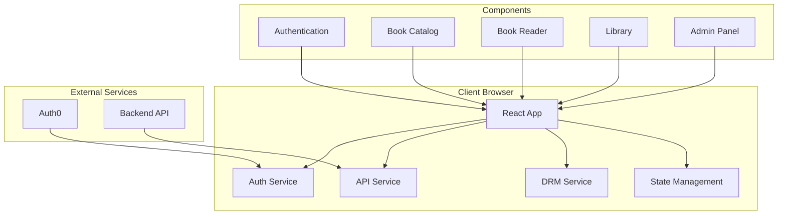

# KAHF Ebook Store Frontend - Design Document

## Overview

The KAHF Ebook Store Frontend is a modern React application built with Vite that provides a comprehensive digital bookstore experience. The application integrates with the Bookstore Backend API to deliver secure book browsing, purchasing, and DRM-protected reading capabilities. The design emphasizes security, performance, and user experience while maintaining the KAHF brand identity.

## Architecture

### High-Level Architecture



### Technology Stack

**Core Framework:**
- **React 18**: Modern React with hooks and concurrent features
- **Vite**: Fast build tool and development server
- **TypeScript**: Type safety and better developer experience
- **React Router**: Client-side routing and navigation

**State Management:**
- **Zustand**: Lightweight state management for global state
- **React Query (TanStack Query)**: Server state management and caching
- **React Hook Form**: Form state management and validation

**UI and Styling:**
- **Tailwind CSS**: Utility-first CSS framework with custom KAHF theme
- **Headless UI**: Accessible UI components
- **React Icons**: Icon library for consistent iconography
- **Framer Motion**: Animation library for smooth transitions

**Authentication and Security:**
- **Auth0 React SDK**: OAuth2 integration and JWT handling
- **Secure Token Storage**: Memory-based token storage with fallback
- **DRM Implementation**: Custom PDF/EPUB viewer with protection

**Development and Build:**
- **ESLint**: Code linting and quality enforcement
- **Prettier**: Code formatting
- **Husky**: Git hooks for pre-commit checks
- **Vite PWA**: Progressive Web App capabilities

## Components and Interfaces

### Component Hierarchy

```
App
├── Layout
│   ├── Header
│   │   ├── Logo
│   │   ├── Navigation
│   │   └── UserMenu
│   ├── Main
│   └── Footer
├── Pages
│   ├── Home
│   ├── BookCatalog
│   ├── BookDetails
│   ├── Library
│   ├── BookReader
│   ├── Profile
│   └── Admin
│       ├── UserManagement
│       └── SystemHealth
├── Components
│   ├── BookCard
│   ├── BookGrid
│   ├── SearchBar
│   ├── FilterPanel
│   ├── PurchaseButton
│   ├── LoadingSpinner
│   ├── ErrorBoundary
│   └── ProtectedRoute
└── Services
    ├── AuthService
    ├── ApiService
    ├── DrmService
    └── StorageService
```

### Core Components Design

#### 1. Authentication Components

**LoginButton Component:**
```typescript
interface LoginButtonProps {
  className?: string;
  children?: React.ReactNode;
}

const LoginButton: React.FC<LoginButtonProps> = ({ className, children }) => {
  const { loginWithRedirect } = useAuth0();
  // Implementation details
};
```

**ProtectedRoute Component:**
```typescript
interface ProtectedRouteProps {
  children: React.ReactNode;
  requiredRoles?: string[];
  fallback?: React.ReactNode;
}

const ProtectedRoute: React.FC<ProtectedRouteProps> = ({ 
  children, 
  requiredRoles, 
  fallback 
}) => {
  // Role-based access control implementation
};
```

#### 2. Book Management Components

**BookCard Component:**
```typescript
interface BookCardProps {
  book: Book;
  isOwned?: boolean;
  onPurchase?: (bookId: number) => void;
  onRead?: (bookId: number) => void;
  className?: string;
}

const BookCard: React.FC<BookCardProps> = ({ 
  book, 
  isOwned, 
  onPurchase, 
  onRead, 
  className 
}) => {
  // Book display and interaction logic
};
```

**BookReader Component:**
```typescript
interface BookReaderProps {
  bookId: number;
  onClose: () => void;
}

const BookReader: React.FC<BookReaderProps> = ({ bookId, onClose }) => {
  // DRM-protected book reading implementation
};
```

#### 3. Search and Filter Components

**SearchBar Component:**
```typescript
interface SearchBarProps {
  onSearch: (query: string) => void;
  placeholder?: string;
  className?: string;
}

const SearchBar: React.FC<SearchBarProps> = ({ onSearch, placeholder, className }) => {
  // Search functionality with debouncing
};
```

**FilterPanel Component:**
```typescript
interface FilterPanelProps {
  authors: string[];
  genres: string[];
  onFilterChange: (filters: BookFilters) => void;
  activeFilters: BookFilters;
}

const FilterPanel: React.FC<FilterPanelProps> = ({ 
  authors, 
  genres, 
  onFilterChange, 
  activeFilters 
}) => {
  // Filter UI and state management
};
```

### Service Layer Design

#### 1. API Service

```typescript
class ApiService {
  private baseURL: string;
  private tokenManager: TokenManager;

  constructor(baseURL: string) {
    this.baseURL = baseURL;
    this.tokenManager = new TokenManager();
  }

  // Book operations
  async getBooks(): Promise<Book[]>;
  async getBook(id: number): Promise<Book>;
  async searchBooks(query: string): Promise<Book[]>;
  async filterBooksByAuthor(author: string): Promise<Book[]>;
  async filterBooksByGenre(genre: string): Promise<Book[]>;
  
  // User operations
  async getMyBooks(): Promise<Book[]>;
  async getMyPurchases(): Promise<Purchase[]>;
  async purchaseBook(bookId: number): Promise<PurchaseResponse>;
  async checkOwnership(bookId: number): Promise<OwnershipResponse>;
  
  // DRM operations
  async getBookContent(bookId: number): Promise<Blob>;
  
  // Admin operations
  async getUserRoles(userId: string): Promise<UserRoles>;
  async setUserRole(userId: string, role: string): Promise<void>;
  
  // Utility methods
  private async makeRequest<T>(endpoint: string, options?: RequestInit): Promise<T>;
  private async handleResponse<T>(response: Response): Promise<T>;
}
```

#### 2. DRM Service

```typescript
class DrmService {
  private apiService: ApiService;
  
  constructor(apiService: ApiService) {
    this.apiService = apiService;
  }

  async loadProtectedBook(bookId: number): Promise<BookContent>;
  async createSecureViewer(content: BookContent): Promise<BookViewer>;
  private preventCopyPaste(element: HTMLElement): void;
  private disableRightClick(element: HTMLElement): void;
  private preventDevTools(): void;
  private addWatermark(element: HTMLElement, userId: string): void;
}
```

#### 3. Token Manager

```typescript
class TokenManager {
  private accessToken: string | null = null;
  private refreshToken: string | null = null;
  
  setTokens(accessToken: string, refreshToken: string): void;
  getAccessToken(): string | null;
  getRefreshToken(): string | null;
  clearTokens(): void;
  isTokenExpired(token: string): boolean;
  async refreshAccessToken(): Promise<string>;
}
```

## Data Models

### Core Data Types

```typescript
// Book related types
interface Book {
  id: number;
  title: string;
  author: string;
  description: string;
  genre: string;
}

interface Purchase {
  purchase_id: number;
  book_id: number;
  book_title: string;
  book_author: string;
  book_genre: string;
  purchase_price: number;
  purchased_at: string;
}

interface OwnershipResponse {
  user_id: string;
  book_id: number;
  book_title: string;
  owns_book: boolean;
  purchase_date?: string;
  purchase_id?: number;
}

// User related types
interface User {
  sub: string;
  name: string;
  email: string;
  email_verified: boolean;
  picture: string;
  updated_at: string;
  roles: UserRole[];
}

interface UserRole {
  id: string;
  name: string;
  description: string;
}

// Authentication types
interface AuthResponse {
  access_token: string;
  refresh_token: string;
  sub: string;
  name: string;
  email: string;
  email_verified: boolean;
  picture: string;
  updated_at: string;
  roles: UserRole[];
}

// UI State types
interface BookFilters {
  author?: string;
  genre?: string;
  searchQuery?: string;
}

interface AppState {
  user: User | null;
  isAuthenticated: boolean;
  books: Book[];
  myBooks: Book[];
  purchases: Purchase[];
  filters: BookFilters;
  loading: boolean;
  error: string | null;
}
```

### State Management Schema

```typescript
// Zustand store structure
interface AppStore {
  // Authentication state
  user: User | null;
  isAuthenticated: boolean;
  login: () => void;
  logout: () => void;
  setUser: (user: User) => void;
  
  // Books state
  books: Book[];
  myBooks: Book[];
  purchases: Purchase[];
  setBooks: (books: Book[]) => void;
  setMyBooks: (books: Book[]) => void;
  setPurchases: (purchases: Purchase[]) => void;
  
  // UI state
  loading: boolean;
  error: string | null;
  setLoading: (loading: boolean) => void;
  setError: (error: string | null) => void;
  
  // Filters state
  filters: BookFilters;
  setFilters: (filters: BookFilters) => void;
  clearFilters: () => void;
}
```

## Error Handling

### Error Handling Strategy

**1. API Error Handling:**
```typescript
class ApiError extends Error {
  constructor(
    public status: number,
    public message: string,
    public details?: any
  ) {
    super(message);
    this.name = 'ApiError';
  }
}

const handleApiError = (error: ApiError): string => {
  switch (error.status) {
    case 401:
      return 'Please log in to continue';
    case 403:
      return 'You don\'t have permission to access this content';
    case 404:
      return 'The requested content was not found';
    case 429:
      return 'Too many requests. Please try again later';
    case 500:
      return 'Server error. Please try again later';
    default:
      return error.message || 'An unexpected error occurred';
  }
};
```

**2. Error Boundary Implementation:**
```typescript
interface ErrorBoundaryState {
  hasError: boolean;
  error?: Error;
}

class ErrorBoundary extends React.Component<
  React.PropsWithChildren<{}>,
  ErrorBoundaryState
> {
  constructor(props: React.PropsWithChildren<{}>) {
    super(props);
    this.state = { hasError: false };
  }

  static getDerivedStateFromError(error: Error): ErrorBoundaryState {
    return { hasError: true, error };
  }

  componentDidCatch(error: Error, errorInfo: React.ErrorInfo) {
    console.error('Error caught by boundary:', error, errorInfo);
    // Log to error reporting service
  }

  render() {
    if (this.state.hasError) {
      return <ErrorFallback error={this.state.error} />;
    }

    return this.props.children;
  }
}
```

**3. DRM Error Handling:**
```typescript
enum DrmErrorType {
  UNAUTHORIZED = 'UNAUTHORIZED',
  FILE_NOT_FOUND = 'FILE_NOT_FOUND',
  NETWORK_ERROR = 'NETWORK_ERROR',
  DECRYPTION_FAILED = 'DECRYPTION_FAILED'
}

class DrmError extends Error {
  constructor(
    public type: DrmErrorType,
    public message: string,
    public bookId?: number
  ) {
    super(message);
    this.name = 'DrmError';
  }
}
```

## Testing Strategy

### Testing Approach

**1. Unit Testing:**
- Component testing with React Testing Library
- Service layer testing with Jest
- Utility function testing
- Custom hook testing

**2. Integration Testing:**
- API integration testing
- Authentication flow testing
- DRM functionality testing
- End-to-end user workflows

**3. Security Testing:**
- DRM bypass attempt testing
- Token handling security testing
- XSS and injection prevention testing
- Access control testing

**Test Structure:**
```
src/
├── __tests__/
│   ├── components/
│   ├── services/
│   ├── hooks/
│   └── utils/
├── __mocks__/
│   ├── auth0.ts
│   ├── api.ts
│   └── drm.ts
└── test-utils/
    ├── render.tsx
    ├── mockData.ts
    └── testServer.ts
```

## Security Considerations

### DRM Implementation

**1. Content Protection:**
- Disable right-click context menu on book content
- Prevent text selection and copying
- Block developer tools access during reading
- Implement canvas-based rendering for sensitive content
- Add user watermarks to discourage sharing

**2. Token Security:**
- Store tokens in memory when possible
- Implement automatic token refresh
- Clear tokens on logout and page unload
- Use secure HTTP-only cookies as fallback

**3. API Security:**
- Validate all API responses
- Implement request/response interceptors
- Use HTTPS for all communications
- Implement proper CORS handling

### Access Control

**Role-Based Access Control:**
```typescript
const useRoleAccess = (requiredRoles: string[]) => {
  const { user } = useAuth0();
  
  const hasAccess = useMemo(() => {
    if (!user?.roles) return false;
    return requiredRoles.some(role => 
      user.roles.some(userRole => userRole.name === role)
    );
  }, [user?.roles, requiredRoles]);
  
  return hasAccess;
};
```

## Performance Optimization

### Optimization Strategies

**1. Code Splitting:**
```typescript
// Lazy load heavy components
const BookReader = lazy(() => import('./components/BookReader'));
const AdminPanel = lazy(() => import('./pages/Admin'));

// Route-based code splitting
const routes = [
  {
    path: '/reader/:bookId',
    element: <Suspense fallback={<LoadingSpinner />}><BookReader /></Suspense>
  }
];
```

**2. Caching Strategy:**
```typescript
// React Query configuration
const queryClient = new QueryClient({
  defaultOptions: {
    queries: {
      staleTime: 5 * 60 * 1000, // 5 minutes
      cacheTime: 10 * 60 * 1000, // 10 minutes
      retry: 3,
      refetchOnWindowFocus: false,
    },
  },
});
```

**3. Image Optimization:**
- Lazy loading for book covers
- WebP format with fallbacks
- Responsive image sizing
- Progressive loading for large images

**4. Bundle Optimization:**
- Tree shaking for unused code
- Dynamic imports for large libraries
- Vendor chunk splitting
- Compression and minification

## Deployment and Build

### Build Configuration

**Vite Configuration:**
```typescript
// vite.config.ts
export default defineConfig({
  plugins: [
    react(),
    VitePWA({
      registerType: 'autoUpdate',
      workbox: {
        globPatterns: ['**/*.{js,css,html,ico,png,svg}']
      }
    })
  ],
  build: {
    target: 'es2020',
    rollupOptions: {
      output: {
        manualChunks: {
          vendor: ['react', 'react-dom'],
          auth: ['@auth0/auth0-react'],
          ui: ['@headlessui/react', 'framer-motion']
        }
      }
    }
  },
  define: {
    'process.env': process.env
  }
});
```

**Environment Configuration:**
```typescript
// Environment variables
interface AppConfig {
  API_BASE_URL: string;
  AUTH0_DOMAIN: string;
  AUTH0_CLIENT_ID: string;
  AUTH0_AUDIENCE: string;
  AUTH0_REDIRECT_URI: string;
}

const config: AppConfig = {
  API_BASE_URL: import.meta.env.VITE_API_BASE_URL,
  AUTH0_DOMAIN: import.meta.env.VITE_AUTH0_DOMAIN,
  AUTH0_CLIENT_ID: import.meta.env.VITE_AUTH0_CLIENT_ID,
  AUTH0_AUDIENCE: import.meta.env.VITE_AUTH0_AUDIENCE,
  AUTH0_REDIRECT_URI: import.meta.env.VITE_AUTH0_REDIRECT_URI,
};
```

### Deployment Strategy

**Production Build:**
1. Environment variable validation
2. TypeScript compilation
3. Bundle optimization and minification
4. Asset optimization (images, fonts)
5. Service worker generation
6. Static file generation

**Hosting Considerations:**
- CDN integration for static assets
- HTTPS enforcement
- Proper CORS configuration
- Cache headers for optimal performance
- Error page handling (404, 500)

This design provides a comprehensive foundation for building the KAHF Ebook Store Frontend with all the required features, security measures, and performance optimizations needed for a production-ready application.